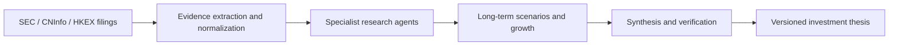

<div align="center">

# OpenThesis

**AI-native, evidence-first company research for long-term investors**

[English](README.md) · [简体中文](README.zh-CN.md)

[](https://github.com/zjy1346/OpenThesis/releases/latest)
[](https://github.com/zjy1346/OpenThesis/releases/latest)
[](pyproject.toml)
[](LICENSE)

Research companies—not short-term price movements.

</div>

OpenThesis is an open-source desktop research system for individual long-term
investors. It turns public filings, deterministic financial analysis, and
specialized AI agents into a traceable investment thesis. You choose the model;
OpenThesis provides the workflow, evidence protocol, financial tools, and
reproducibility layer.

> [!IMPORTANT]
> OpenThesis does not connect to brokerage accounts, execute trades, provide
> short-term signals, or promise investment returns.

## Why OpenThesis?

- **Bring your own model.** Use DeepSeek, Qwen, Kimi, GLM, OpenAI, Gemini,
  OpenRouter, Ollama, or any OpenAI-compatible endpoint.
- **Evidence before opinion.** AI-generated factual claims must cite the filing
  evidence collected for the run.
- **Deterministic finance.** Financial summaries and reverse DCF calculations
  are produced by code, not improvised by a language model.
- **Purpose-built agents.** Financial, business, accounting-risk, growth,
  skeptical, forecasting, synthesis, and verification agents collaborate on the
  same evidence.
- **Reproducible research.** Each run records its model, parameters, research
  pack, data snapshot, and report language.
- **Local-first privacy.** API keys stay in memory for the current session and
  are never written to the application database.

## Research pipeline



See the consolidated architecture and product specification in
[docs/PROJECT_SPEC.md](docs/PROJECT_SPEC.md).
The checked migration boundary and remaining stable-1.0 gates are tracked in
[docs/MIGRATION_STATUS.md](docs/MIGRATION_STATUS.md).

## Download and run

1. Open the [latest release](https://github.com/zjy1346/OpenThesis/releases/latest)
   and download the Windows x64 portable ZIP.
2. Verify it against the attached SHA-256 file.
3. Extract the complete archive and run `OpenThesis\OpenThesis.exe`. Keep the
   adjacent `bin` directory in place.
4. Run the synthetic demo for a fully offline first experience.

The first launch defaults to **no AI calls**. Research context is sent only
after you explicitly choose a model and start a research run. Online model lists
are requested only when you click **Refresh online models**.

## Language settings

Open **Settings** to configure two independent options:

| Setting | Options | Takes effect |
| --- | --- | --- |
| Interface language | Simplified Chinese / English | After restarting the app |
| Research-report language | Simplified Chinese / English | On the next research run |

Changing either option does not clear the selected company, model settings,
research configuration, or in-memory API key. Existing AI text in historical
reports is not translated; only application-generated headings and
deterministic sections are rendered in the current report language.

## Supported model entry points

| Region | Providers |
| --- | --- |
| China | DeepSeek, Qwen, Kimi, GLM |
| International | OpenAI, Gemini, OpenRouter |
| Local | Ollama |
| Custom | Any OpenAI-compatible endpoint |

Recommended models are built in as fallbacks. Remote model discovery is
explicit, runs in the background, and never erases the built-in choices when a
provider returns an error.

## Run from source

Install Python 3.11 or newer. If `python` is not on `PATH`, set
`OPENTHESIS_PYTHON` to the full path of `python.exe`. The repository never stores
a machine-specific Python path.

```powershell
powershell -ExecutionPolicy Bypass -File .\scripts\run.ps1
```

To run the new desktop architecture, install Node.js, Rust, and the Visual C++
Build Tools, then run:

```powershell
powershell -ExecutionPolicy Bypass -File .\scripts\desktop.ps1 dev
```

For a network-free first run, select the synthetic demo company. Configure a
valid SEC contact email only when querying real US-listed companies.

## Test and package

```powershell
powershell -ExecutionPolicy Bypass -File .\scripts\test.ps1
python -m pip install pyinstaller
powershell -ExecutionPolicy Bypass -File .\scripts\package.ps1
```

Build the Tauri preview and its Python sidecar with:

```powershell
powershell -ExecutionPolicy Bypass -File .\scripts\package-desktop.ps1
```

The packaging command runs the complete test suite, builds the frozen Windows
application, executes deterministic and bilingual GUI smoke tests, and creates
a portable ZIP plus SHA-256 checksum in `installer-output/`.

## Privacy and security

- API keys are session-only: they are not saved to SQLite, settings files,
  reports, or logs.
- SEC contact details are stored only in the user's local application data.
  They are not bundled into release archives.
- Research history is stored per user outside the installed application
  directory and is never packaged with the portable release.
- Model endpoints and model IDs remain editable; selecting `none` performs
  deterministic analysis without sending context to an AI provider.

Please report security issues without posting secrets, personal data, or API
keys in a public issue.

## Contributing

Issues and pull requests are welcome. Research modules use the declarative
`.othesis` format, allowing contributors to add workflows and prompts without
shipping executable Python code.

## License

Licensed under the [Apache License 2.0](LICENSE).
