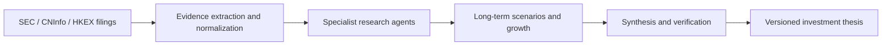
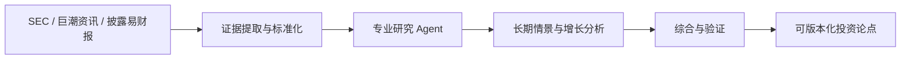

<a id="readme-en"></a>

<div align="center">

# OpenThesis

**AI-native, evidence-first company research for long-term investors**

[English](https://github.com/zjy1346/OpenThesis#readme-en) · [简体中文](https://github.com/zjy1346/OpenThesis#readme-zh-cn) · [繁體中文](https://github.com/zjy1346/OpenThesis#readme-zh-hant)

[](https://github.com/zjy1346/OpenThesis/releases/latest)
[](https://github.com/zjy1346/OpenThesis/releases/latest)
[](pyproject.toml)
[](LICENSE)

Research companies—not short-term price movements.

</div>

## See it in action

The workspace keeps deterministic financial summaries, source evidence, and
the live research stages visible in one traceable flow.


_Deterministic financial overview and year-over-year comparison._


_Source pages and evidence remain available for audit._


_Specialist agents report their progress without hiding the current stage._

OpenThesis is an open-source desktop research system for individual long-term
investors. It turns public filings, deterministic financial analysis, and
specialized AI agents into a traceable investment thesis. You choose the model;
OpenThesis provides the workflow, evidence protocol, financial tools, and
reproducibility layer.

> [!IMPORTANT]
> OpenThesis does not connect to brokerage accounts, execute trades, provide
> short-term signals, or promise investment returns.

## Why OpenThesis?

- **Bring your own model.** Use DeepSeek, Qwen, Kimi, GLM, OpenAI, Gemini,
  OpenRouter, Ollama, or any OpenAI-compatible endpoint.
- **Evidence before opinion.** AI-generated factual claims must cite the filing
  evidence collected for the run.
- **Deterministic finance.** Financial summaries and reverse DCF calculations
  are produced by code, not improvised by a language model.
- **Purpose-built agents.** Financial, business, accounting-risk, growth,
  skeptical, forecasting, synthesis, and verification agents collaborate on the
  same evidence.
- **Reproducible research.** Each run records its model, parameters, research
  pack, data snapshot, and report language.
- **Local-first privacy.** API keys stay in memory for the current session and
  are never written to the application database.

## Research pipeline



See the consolidated architecture and product specification in
[docs/PROJECT_SPEC.md](docs/PROJECT_SPEC.md).
The checked migration boundary and remaining stable-1.0 gates are tracked in
[docs/MIGRATION_STATUS.md](docs/MIGRATION_STATUS.md).

## Download and run

1. Open the [latest release](https://github.com/zjy1346/OpenThesis/releases/latest)
   and download the Windows x64 portable ZIP.
2. Verify it against the attached SHA-256 file.
3. Extract the complete archive and run `OpenThesis\OpenThesis.exe`. Keep the
   adjacent `bin` directory in place.
4. Run the synthetic demo for a fully offline first experience.

The first launch defaults to **no AI calls**. Research context is sent only
after you explicitly choose a model and start a research run. Online model lists
are requested only when you click **Refresh online models**.

## Language settings

Open **Settings** to configure two independent options:

| Setting | Options | Takes effect |
| --- | --- | --- |
| Interface language | Simplified Chinese / English | After restarting the app |
| Research-report language | Simplified Chinese / English | On the next research run |

Changing either option does not clear the selected company, model settings,
research configuration, or in-memory API key. Existing AI text in historical
reports is not translated; only application-generated headings and
deterministic sections are rendered in the current report language.

## Supported model entry points

| Region | Providers |
| --- | --- |
| China | DeepSeek, Qwen, Kimi, GLM |
| International | OpenAI, Gemini, OpenRouter |
| Local | Ollama |
| Custom | Any OpenAI-compatible endpoint |

Recommended models are built in as fallbacks. Remote model discovery is
explicit, runs in the background, and never erases the built-in choices when a
provider returns an error.

## Run from source

Install Python 3.11 or newer. If `python` is not on `PATH`, set
`OPENTHESIS_PYTHON` to the full path of `python.exe`. The repository never stores
a machine-specific Python path.

```powershell
powershell -ExecutionPolicy Bypass -File .\scripts\run.ps1
```

To run the new desktop architecture, install Node.js, Rust, and the Visual C++
Build Tools, then run:

```powershell
powershell -ExecutionPolicy Bypass -File .\scripts\desktop.ps1 dev
```

For a network-free first run, select the synthetic demo company. Configure a
valid SEC contact email only when querying real US-listed companies.

## Test and package

```powershell
powershell -ExecutionPolicy Bypass -File .\scripts\test.ps1
python -m pip install pyinstaller
powershell -ExecutionPolicy Bypass -File .\scripts\package.ps1
```

Build the Tauri preview and its Python sidecar with:

```powershell
powershell -ExecutionPolicy Bypass -File .\scripts\package-desktop.ps1
```

The packaging command runs the complete test suite, builds the frozen Windows
application, executes deterministic and bilingual GUI smoke tests, and creates
a portable ZIP plus SHA-256 checksum in `installer-output/`.

## Privacy and security

- API keys are session-only: they are not saved to SQLite, settings files,
  reports, or logs.
- SEC contact details are stored only in the user's local application data.
  They are not bundled into release archives.
- Research history is stored per user outside the installed application
  directory and is never packaged with the portable release.
- Model endpoints and model IDs remain editable; selecting `none` performs
  deterministic analysis without sending context to an AI provider.

Please report security issues without posting secrets, personal data, or API
keys in a public issue.

## Contributing

Issues and pull requests are welcome. Research modules use the declarative
`.othesis` format, allowing contributors to add workflows and prompts without
shipping executable Python code.

## License

Licensed under the [Apache License 2.0](LICENSE).

---

<a id="readme-zh-cn"></a>

## 简体中文

以 AI 为核心、以证据为基础的长期公司研究工具。研究公司，而不是预测短期价格。

## 界面预览

研究工作台会在同一条可追溯流程中展示确定性财务概览、来源证据和实时研究阶段。


_确定性财务概览与同比比较。_


_来源页和证据始终可供审计。_


_专业 Agent 会显示当前阶段，不隐藏研究进度。_

OpenThesis 是一款面向个人长期投资者的开源桌面研究系统。它将公开财报、确定性财务分析和专业 AI Agent
组合为可追溯的投资论点。模型由用户选择；OpenThesis 提供研究流程、证据协议、财务工具和可复现能力。

> [!IMPORTANT]
> OpenThesis 不连接券商账户、不执行交易、不提供短线信号，也不承诺任何投资回报。

## 为什么选择 OpenThesis？

- **模型由你选择。** 支持 DeepSeek、Qwen、Kimi、GLM、OpenAI、Gemini、OpenRouter、Ollama，以及任意 OpenAI-compatible 接口。
- **先证据，后观点。** AI 生成的事实性结论必须引用本次研究收集的财报证据。
- **确定性财务计算。** 财务概览和反向 DCF 由程序计算，不交给语言模型自由发挥。
- **专业 Agent 协作。** 财务、商业模式、会计风险、增长、质疑、预测、综合和验证 Agent 基于同一组证据共同研究。
- **研究可复现。** 每次运行都会记录模型、参数、研究模块、数据快照和报告语言。
- **本地优先与隐私保护。** API Key 只存在于当前会话内存中，不写入应用数据库。

## 研究流程



完整产品与架构说明见 [docs/PROJECT_SPEC.md](docs/PROJECT_SPEC.md)。
已完成能力、剩余迁移项与稳定版退出条件见 [docs/MIGRATION_STATUS.md](docs/MIGRATION_STATUS.md)。

## 下载与运行

1. 打开[最新版本](https://github.com/zjy1346/OpenThesis/releases/latest)，下载 Windows x64 便携 ZIP。
2. 使用随附的 SHA-256 文件核对压缩包。
3. 完整解压后运行 `OpenThesis\OpenThesis.exe`，并保留旁边的 `bin` 目录。
4. 首次体验运行合成演示研究，全程离线且不需要 API Key。

首次启动默认**不调用 AI**。只有用户主动选择模型并开始研究时，研究上下文才会发送到所选接口。
在线模型列表也只会在用户点击“刷新在线模型”后请求。

## 语言设置

打开“设置”页面可分别配置：

| 设置 | 可选项 | 生效时间 |
| --- | --- | --- |
| 界面语言 | 简体中文 / English | 重启应用后 |
| 研究报告语言 | 简体中文 / English | 下一次研究立即生效 |

保存设置不会清空当前公司、模型设置、研究配置或会话中的 API Key。历史报告中的既有 AI
正文不会被翻译；只有程序生成的标题和确定性章节会按当前报告语言重新渲染。

## 支持的模型入口

| 地区 | 提供方 |
| --- | --- |
| 国内 | DeepSeek、Qwen、Kimi、GLM |
| 国外 | OpenAI、Gemini、OpenRouter |
| 本地 | Ollama |
| 自定义 | 任意 OpenAI-compatible 接口 |

应用内置推荐模型作为可靠回退。在线模型目录只会由用户主动刷新，并在后台运行；即使接口返回错误，
内置选项也不会被清空。

## 从源码运行

安装 Python 3.11 或更高版本。如果 `python` 不在 `PATH` 中，请将 `OPENTHESIS_PYTHON` 设置为 `python.exe` 的完整路径。仓库不会保存任何机器专属 Python 路径。

```powershell
powershell -ExecutionPolicy Bypass -File .\scripts\run.ps1
```

如需运行新的桌面架构，请先安装 Node.js、Rust 与 Visual C++ Build Tools，然后执行：

```powershell
powershell -ExecutionPolicy Bypass -File .\scripts\desktop.ps1 dev
```

不使用网络时可选择合成演示公司。只有查询真实的美国上市公司时，才需要配置有效的 SEC 联系邮箱。

## 测试与打包

```powershell
powershell -ExecutionPolicy Bypass -File .\scripts\test.ps1
python -m pip install pyinstaller
powershell -ExecutionPolicy Bypass -File .\scripts\package.ps1
```

构建 Tauri 预览版及其 Python sidecar：

```powershell
powershell -ExecutionPolicy Bypass -File .\scripts\package-desktop.ps1
```

打包脚本会运行完整测试、构建 Windows 冻结应用、执行确定性测试和中英文 GUI 冒烟测试，并在
`installer-output/` 中生成便携 ZIP 与 SHA-256 校验文件。

## 隐私与安全

- API Key 只存在于当前会话，不写入 SQLite、设置文件、报告或日志。
- SEC 联系信息只保存在用户本机的应用数据目录中，不会进入发布安装包。
- 研究历史按用户保存在安装目录之外，绝不会被打包进便携版。
- 模型地址与模型 ID 始终可编辑；选择 `none` 时仅运行确定性分析，不向 AI 提供方发送上下文。

报告安全问题时，请勿在公开 Issue 中粘贴密钥、个人信息或 API Key。

## 参与贡献

欢迎提交 Issue 和 Pull Request。研究模块采用声明式 `.othesis` 格式，贡献者无需分发可执行 Python 代码，也能扩展工作流与提示词。

## 许可证

本项目采用 [Apache License 2.0](LICENSE)。

---

<a id="readme-zh-hant"></a>

## 繁體中文

以 AI 為核心、以證據為基礎的長期公司研究工具。研究公司，而不是預測短期價格。

## 介面預覽

研究工作台會在同一條可追溯流程中展示確定性財務概覽、來源證據與即時研究階段。


_確定性財務概覽與年度比較。_


_來源頁與證據始終可供審計。_


_專業 Agent 會顯示目前階段，不隱藏研究進度。_

OpenThesis 是面向個人長期投資者的開源桌面研究系統。它將公開財報、確定性財務分析與專業 AI Agent 組合為可追溯的投資論點。模型由您選擇；OpenThesis 提供研究流程、證據協定、財務工具與可重現性。

> [!IMPORTANT]
> OpenThesis 不連線券商帳戶、不執行交易、不提供短線訊號，也不承諾投資回報。

## 主要功能

- **自行選擇模型。** 支援 DeepSeek、Qwen、Kimi、GLM、OpenAI、Gemini、OpenRouter、Ollama，以及任意 OpenAI-compatible 端點。
- **先證據，後觀點。** AI 產生的事實性結論必須引用本次研究收集的財報證據。
- **確定性財務計算。** 財務概覽與反向 DCF 由程式計算，不交給語言模型自由編造。
- **專業 Agent 協作。** 財務、商業模式、會計風險、增長、反方審查、預測、綜合與驗證 Agent 共用同一組證據。
- **研究可重現。** 每次執行會記錄模型、參數、研究模組、資料快照與報告語言。
- **本地優先與隱私。** API Key、視覺 Token 與自訂端點密鑰只存在目前工作階段，不寫入資料庫或報告。

## 研究流程

1. 選擇上市市場與公司，確認代碼、交易所及官方披露來源。
2. 選擇研究模組與報告語言；介面語言可跟隨系統或手動選擇。
3. 先由結構化資料與官方 PDF 解析財報，按期間、合併口徑、幣種、單位與證據頁驗證。
4. 通過品質門的事實才會送入 Agent；不足或矛盾的資料會隔離，不會被模型補造。
5. 閱讀確定性財務概覽、研究報告與技術詳情，必要時匯出 Markdown 或 HTML。

## 語言設定

OpenThesis 內建 `zh-CN`、`zh-Hant` 與 `en`。新安裝預設跟隨作業系統語言；設定中可改為手動選擇。介面語言與報告語言彼此獨立，例如使用繁體介面並輸出英文報告。`zh-TW`、`zh-HK`、`zh-Hant` 等外部標籤會統一為 `zh-Hant`。

## 安裝與安全

Windows 測試版可從 Releases 下載 portable ZIP，解壓後執行 `OpenThesis\OpenThesis.exe`。首次啟動不呼叫 AI；只有您主動選擇模型並開始研究時，研究上下文才會送往您設定的服務。API Key 不會寫入本機設定、研究歷史或日誌。

視覺財報備援是可選的雲端功能，僅在本地解析失敗、您明確同意後上傳必要財務表頁，並受 20 頁／10 MB 限制。OpenThesis 不訓練、不下載、不捆綁本地模型。

## 研究模組

內建 `official.long-term-fundamentals` 模組涵蓋財務、商業模式、會計風險、增長機會、反方審查與長期情境。`.othesis` 模組是受權限限制的宣告式 ZIP，不可要求 network、filesystem 或 execute_code 權限。

## 支援的市場與來源

OpenThesis 將上市幣種與財報報告幣種分開保存。支援美股 SEC EDGAR、港股 HKEX／發行人披露，以及滬深北交易所與巨潮資訊官方披露。研究會先選擇最近且適用的年報、季報或中期報告，並保留公告識別、報告期、修訂關係、頁碼與原文證據。

財報核心事實包括收入、淨利潤、經營現金流、資產、負債與權益；可用時也會計算營業利潤率、自由現金流、資本支出及年度連續性。不同期間、合併口徑、幣種或單位不會被混合；失敗的年度會顯示為不可用，而不是靜默當成零。

## 模型與資料邊界

你可以使用內建模型目錄、手動模型 ID、OpenAI-compatible 端點或本地 Ollama。模型只接收通過品質門的事實與必要研究上下文；確定性計算由本地程式完成。模型輸出會經過協定白名單與語言投影，避免將內部 JSON 欄位直接顯示給一般讀者。

雲端視覺財報備援不是預設功能。只有本地結構化來源及 PDF 表格解析失敗、你開啟功能並勾選上傳同意後，系統才會定位缺失的合併財務表頁。上傳前會顯示文件、頁面、大小與指紋供確認；每個視覺候選仍須通過相同的期間、單位、幣種、口徑與勾稽品質門。

## 隱私與安全檢查

- API Key、SEC 聯絡信箱、MinerU Token 與自訂視覺 API Key 僅保留在目前工作階段。
- 研究歷史與設定不保存上述秘密；錯誤診斷只保留安全的錯誤類型與階段資訊。
- 發布壓縮檔不包含使用者資料庫、研究歷史、個人絕對路徑或開發憑證。
- `.othesis` 研究模組會先驗證權限宣告；不允許要求執行程式碼、任意檔案系統、網路或秘密存取。

## 匯出與審計

報告可匯出為 Markdown 或 HTML。一般模式顯示本地化的執行摘要、主要結論、反方觀點、失效條件、領先指標與未解決問題；技術模式另外顯示來源、證據頁、品質驗證與隔離原因。證據 ID 與協定鍵保持穩定，便於在本機重現研究，不代表投資建議。

## 開發與測試詳情

Python 核心需要 Python 3.11 或更新版本；桌面工作區使用 Node.js 與 pnpm。常用檢查如下：

```powershell
$env:PYTHONPATH = "src"
python -m unittest discover -s tests -p "test_*.py"
cd desktop
pnpm test
pnpm build
```

修改語言目錄時，請保持 `language-contract.json`、Python 語言註冊表與 TypeScript 註冊表的 ID、別名、HTML 語言標籤、文字方向及 fallback 一致。新增語言應先加入註冊表與完整目錄，再新增測試，不要在頁面元件內散落語言分支。

## 版本與回饋

請在回報問題時附上 OpenThesis 版本、作業系統、研究市場、報告期及不含秘密的錯誤階段。不要貼 API Key、SEC 聯絡信箱、研究資料庫或完整財報 PDF；如需重現，請提供官方公告識別與最小必要頁面資訊。

## 常見研究情境

### 年報、季報與中期報告

系統會將 FY、Q1、H1／Q2 與 Q3／9M 分開選取，季度或中期數字只和相同期間比較。公告日期不會被誤當成報告期末；非自然財年的起始日也會依官方期間推導。更正公告和修訂報告會依公告類別、修訂關係與權威時間排序。

### 合併與母公司口徑

財務表會優先辨識正式的合併損益表、資產負債表與現金流量表。母公司、單體或附註中的相似欄位不會與合併欄位混用。每個事實保留表名、列標籤、期間欄位、頁碼、原文摘錄與來源指紋，方便回到官方文件核對。

### 失敗與隔離

如果資產不等於負債加權益、單位或幣種不一致、核心欄位不足、來源證據不完整，該期間會進入隔離區。隔離事實仍可在技術詳情中審計，但不會進入確定性指標、研究上下文或模型提示。缺失值顯示為「—」，不會被當作零。

## 研究包權限

研究包以 ZIP 形式保存 manifest、工作流與提示模板。安裝前會驗證 API 版本、雜湊、支援語言及權限聲明；只接受 Markdown、JSON-compatible YAML、JSON Schema 與文字內容。研究包不能要求執行程式碼、任意檔案系統、網路或秘密存取。

自訂研究包可以加入領域問題、比較維度與輸出段落，但 OpenThesis 仍會追加證據要求、財務品質門、報告語言約束及安全白名單。內部協定鍵和 enum 不因翻譯而改變。

## 使用建議

首次研究建議先選擇離線合成示範公司，確認報告語言、介面語言與匯出格式，再設定模型。真實美股研究前先填寫自己的 SEC 請求者身份與可聯絡電郵；這不是目標公司的投資者關係電郵，也不會被 OpenThesis 代替填寫。

研究前請確認官方披露來源、報告期與幣種。對跨市場公司，上市幣種可能是 HKD，而財報報告幣種可能是 CNY、USD 或其他披露幣種；報告會分別顯示，避免讀者誤以為程式自動換匯。

研究完成後可先閱讀確定性財務概覽，再閱讀主要結論、反方觀點和未解決問題。低置信度內容會以不同視覺標記顯示；關閉技術詳情後，畫面不會顯示證據 ID、內部欄位或原始協定錯誤。

## 開源與授權

OpenThesis 使用 Apache-2.0 授權。歡迎提交不含秘密與個人資料的問題回報、測試案例或文件改善；涉及官方財報時，請引用公告 ID、來源 URL、報告期與最小必要摘錄，不要提交完整受版權限制的報告。

## 開發

```powershell
$env:PYTHONPATH = "src"
python -m unittest discover -s tests -p "test_*.py"
cd desktop
pnpm test
pnpm build
```

提交前請執行 `git diff --check`，並確認測試輸出與打包檔案沒有 API Key、SEC 聯絡信箱、使用者資料庫或個人路徑。

## 授權

Apache-2.0。OpenThesis 是研究輔助工具，不構成投資建議。
