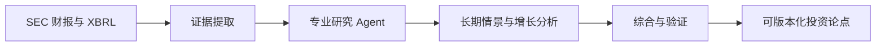

<div align="center">

# OpenThesis

**以 AI 为核心、以证据为基础的长期公司研究工具**

[English](README.md) · [简体中文](README.zh-CN.md)

[](https://github.com/zjy1346/OpenThesis/releases/latest)
[](https://github.com/zjy1346/OpenThesis/releases/latest)
[](pyproject.toml)
[](LICENSE)

研究公司，而不是预测短期价格。

</div>

OpenThesis 是一款面向个人长期投资者的开源桌面研究系统。它将公开财报、确定性财务分析和专业 AI Agent
组合为可追溯的投资论点。模型由用户选择；OpenThesis 提供研究流程、证据协议、财务工具和可复现能力。

> [!IMPORTANT]
> OpenThesis 不连接券商账户、不执行交易、不提供短线信号，也不承诺任何投资回报。

> [!NOTE]
> **v1.0.0-alpha.1 是架构预览版。** 本版引入新的 Tauri + React 桌面外壳与隔离的
> Python 研究核心，当前支持离线合成演示、进度与取消、报告历史及双语言设置。
> 真实公司 SEC 研究、模型配置、研究模块、反向 DCF 控件和投资逻辑管理仍保留在旧版
> Python 界面中，并将在后续版本继续迁移。

## 为什么选择 OpenThesis？

- **模型由你选择。** 支持 DeepSeek、Qwen、Kimi、GLM、OpenAI、Gemini、
  OpenRouter、Ollama，以及任意 OpenAI-compatible 接口。
- **先证据，后观点。** AI 生成的事实性结论必须引用本次研究收集的财报证据。
- **确定性财务计算。** 财务概览和反向 DCF 由程序计算，不交给语言模型自由发挥。
- **专业 Agent 协作。** 财务、商业模式、会计风险、增长、质疑、预测、综合和验证 Agent
  基于同一组证据共同研究。
- **研究可复现。** 每次运行都会记录模型、参数、研究模块、数据快照和报告语言。
- **本地优先与隐私保护。** API Key 只存在于当前会话内存中，不写入应用数据库。

## 研究流程



## v0.5.0 亮点

- 使用现代 HTML 报告阅读器替代原始 Markdown 展示，财务表格、核心指标、证据提示和增长机会
  均以清晰的结构化组件呈现。
- 增长机会采用经过验证的数据结构，统一展示本地化字段、证据等级、可能性区间、时间跨度和适用情景。
- Evidence ID 与 Agent ID 默认隐藏，需要时可通过“技术详情”查看。
- 新增沉浸阅读模式，报告覆盖整个程序内容区但不改变底层布局；使用 Windows 合成淡入淡出，
  避免反复重排 HTML。支持 `F11` 进入或退出、`Esc` 恢复普通视图。
- 报告支持 80%–160% 缩放、按钮、键盘快捷键和 Ctrl+鼠标滚轮。
- SEC XBRL 备用概念可补齐缺失财年，同时保持标准概念优先级。
- 报告可导出为独立 HTML、Markdown 或纯文本。
- 完整保留双语言界面和研究报告语言控制。

完整产品与架构说明见 [docs/PROJECT_SPEC.md](docs/PROJECT_SPEC.md)。

## 下载与运行

1. 打开[最新版本](https://github.com/zjy1346/OpenThesis/releases/latest)，下载 Windows x64 安装程序。
2. 使用随附的 SHA-256 文件核对安装包。
3. 安装并启动 OpenThesis。
4. 首次体验运行合成演示研究，全程离线且不需要 API Key。

首次启动默认**不调用 AI**。只有用户主动选择模型并开始研究时，研究上下文才会发送到所选接口。
在线模型列表也只会在用户点击“刷新在线模型”后请求。

## 语言设置

打开“设置”页面可分别配置：

| 设置 | 可选项 | 生效时间 |
| --- | --- | --- |
| 界面语言 | 简体中文 / English | 重启应用后 |
| 研究报告语言 | 简体中文 / English | 下一次研究立即生效 |

保存设置不会清空当前公司、模型设置、研究配置或会话中的 API Key。历史报告中的既有 AI
正文不会被翻译；只有程序生成的标题和确定性章节会按当前报告语言重新渲染。

## 支持的模型入口

| 地区 | 提供方 |
| --- | --- |
| 国内 | DeepSeek、Qwen、Kimi、GLM |
| 国外 | OpenAI、Gemini、OpenRouter |
| 本地 | Ollama |
| 自定义 | 任意 OpenAI-compatible 接口 |

应用内置推荐模型作为可靠回退。在线模型目录只会由用户主动刷新，并在后台运行；即使接口返回错误，
内置选项也不会被清空。

## 从源码运行

安装 Python 3.11 或更高版本。如果 `python` 不在 `PATH` 中，请将
`OPENTHESIS_PYTHON` 设置为 `python.exe` 的完整路径。仓库不会保存任何机器专属 Python 路径。

```powershell
powershell -ExecutionPolicy Bypass -File .\scripts\run.ps1
```

如需运行新的桌面架构，请先安装 Node.js、Rust 与 Visual C++ Build Tools，然后执行：

```powershell
powershell -ExecutionPolicy Bypass -File .\scripts\desktop.ps1 dev
```

不使用网络时可选择合成演示公司。只有查询真实的美国上市公司时，才需要配置有效的 SEC 联系邮箱。

## 测试与打包

```powershell
powershell -ExecutionPolicy Bypass -File .\scripts\test.ps1
python -m pip install pyinstaller
powershell -ExecutionPolicy Bypass -File .\scripts\package.ps1
```

构建 Tauri 预览版及其 Python sidecar：

```powershell
powershell -ExecutionPolicy Bypass -File .\scripts\package-desktop.ps1
```

打包脚本会运行完整测试、构建 Windows 冻结应用、执行确定性测试和中英文 GUI 冒烟测试，并在
`installer-output/` 中生成便携 ZIP 与 SHA-256 校验文件。

## 隐私与安全

- API Key 只存在于当前会话，不写入 SQLite、设置文件、报告或日志。
- SEC 联系信息只保存在用户本机的应用数据目录中，不会进入发布安装包。
- 研究历史按用户保存在安装目录之外，绝不会被打包进便携版。
- 模型地址与模型 ID 始终可编辑；选择 `none` 时仅运行确定性分析，不向 AI 提供方发送上下文。

报告安全问题时，请勿在公开 Issue 中粘贴密钥、个人信息或 API Key。

## 参与贡献

欢迎提交 Issue 和 Pull Request。研究模块采用声明式 `.othesis` 格式，贡献者无需分发可执行
Python 代码，也能扩展工作流与提示词。

## 许可证

本项目采用 [Apache License 2.0](LICENSE)。
