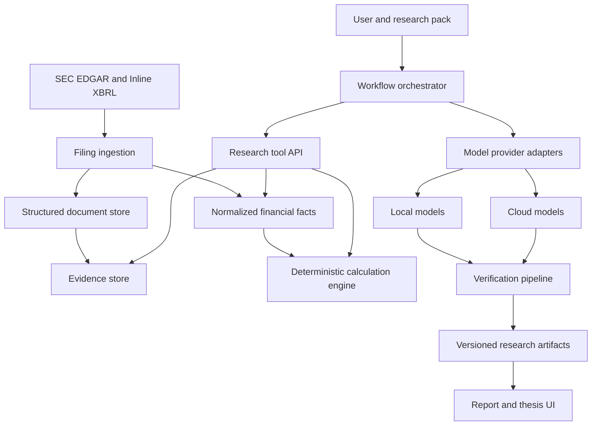

# OpenThesis Project Specification

Status: Draft v0.1  
Date: 2026-07-29  
Working title: OpenThesis

## 1. Purpose

OpenThesis is an open-source, AI-centered company research system for serious individual long-term investors.

The product does not attempt to predict short-term stock-price movements. It helps a user answer:

1. How does this company make money?
2. What does its financial history reveal about business quality?
3. Which company- or industry-level growth opportunities may matter over the next three to five years?
4. What assumptions are already implied by the current valuation?
5. Which facts support or contradict the investment thesis?
6. What future evidence would strengthen, weaken, or invalidate the thesis?

The user owns the model choice and investment decision. OpenThesis owns the research protocol, evidence handling, deterministic calculations, prompt packs, agent orchestration, verification, and reproducibility.

## 2. Confirmed product decisions

### 2.1 Target user

The first target user is a serious individual investor who understands basic financial concepts but does not have access to an institutional research terminal or analyst team.

The first version is not optimized for:

- complete beginners who want a single buy/sell answer;
- institutional teams requiring proprietary datasets and collaboration;
- traders focused on intraday or short-term price movements.

### 2.2 Initial market

The first supported market is US-listed equities.

The first document source is SEC EDGAR:

- 10-K filings;
- filing metadata and history;
- Inline XBRL and extracted company facts.

Useful official references:

- https://www.sec.gov/search-filings/edgar-application-programming-interfaces
- https://www.sec.gov/data-research/structured-data/inline-xbrl

A-share and Hong Kong support are later market adapters. They must not delay the first complete US-company research workflow.

### 2.3 No transaction functionality

OpenThesis will not:

- connect to brokerage accounts;
- hold brokerage credentials;
- submit, modify, or cancel orders;
- perform automatic trading;
- generate short-term trading signals;
- optimize engagement by encouraging trading frequency;
- claim guaranteed or model-proven returns.

Watchlists, hypothetical portfolios, research alerts, and investment-thesis monitoring are allowed because they support research rather than execution.

### 2.4 Model choice belongs to the user

The product must support both local and cloud models through a provider abstraction.

Initial provider scope:

- Ollama or an equivalent local provider;
- OpenAI-compatible HTTP APIs;
- at least one native cloud-provider adapter where the generic protocol is insufficient.

Every report records the provider, model identifier, model parameters, workflow version, research-pack version, and data snapshot.

## 3. Product principles

1. **Bring your own model.**
2. **Bring your own permitted data.**
3. **Every factual claim needs traceable evidence.**
4. **Financial math is deterministic code, not language-model arithmetic.**
5. **Facts, inferences, assumptions, and unknowns are separate data types.**
6. **Forecasts are scenarios, not precise prophecies.**
7. **Every report is reproducible.**
8. **The system must be able to say that evidence is insufficient.**
9. **AI supports decisions; the user makes them.**
10. **No research module may disable core safety and verification rules.**

## 4. Core user journey

### 4.1 Configure a model

The user selects a local, cloud, or custom model endpoint. The system tests:

- connectivity;
- structured-output support;
- tool-calling support;
- context capacity;
- optional vision support;
- expected report cost and latency.

API keys stay in local secret storage and must not be saved in reports, logs, exported research packs, or the main application database in plaintext.

### 4.2 Select a company

The user searches by company name, ticker, or CIK. The system shows:

- available filings;
- fiscal periods;
- filing and amendment dates;
- structured financial facts;
- any missing or conflicting data.

### 4.3 Select a research workflow

Initial workflow choices:

- quick company overview;
- complete long-term fundamental research;
- financial-statement quality review;
- compare two filing periods;
- management promise tracking;
- growth-opportunity research;
- long-term scenario forecast;
- reverse DCF;
- challenge an existing investment thesis.

The primary MVP path is complete long-term fundamental research.

### 4.4 Review the research plan

Before execution, the product shows:

- agents and steps that will run;
- selected models;
- tools each agent may use;
- estimated cost;
- maximum runtime;
- maximum calls;
- installed research pack and version.

The user can start, cancel, pause, or rerun an individual failed step.

### 4.5 Inspect results

The result is a structured report rather than a single block of generated prose. A user can click any factual claim to open its exact source.

### 4.6 Save a thesis

The user can accept, edit, reject, or mark conclusions as unresolved. Saved theses preserve their assumptions, evidence, counterevidence, risks, and invalidation conditions.

## 5. MVP scope

### 5.1 Required MVP capabilities

The first usable release must:

1. identify a US-listed company;
2. download and cache its latest five annual 10-K filings;
3. parse filing structure, text, tables, and available XBRL facts;
4. normalize core financial facts across periods;
5. support at least one local and one cloud-compatible model path;
6. run specialized financial, business, risk, growth, forecast, and verification steps;
7. produce a structured report with clickable evidence;
8. distinguish facts, inferences, assumptions, and unknowns;
9. calculate financial metrics and valuation outputs deterministically;
10. save a versioned investment thesis;
11. compare outputs from two selected models;
12. import an `.othesis` research module;
13. run locally through a documented, low-friction installation path.

### 5.2 Explicitly deferred

- real-time market data;
- automated periodic monitoring;
- 10-Q and earnings-call coverage beyond what is needed for the first workflow;
- A-share and Hong Kong filing adapters;
- brokerage integration;
- transaction execution;
- technical-analysis indicators;
- social stock recommendations;
- multi-user cloud collaboration;
- a public model leaderboard;
- arbitrary executable-code plugins;
- mobile applications.

## 6. High-level architecture

### 6.1 Version 0.1 implementation shape

- Interface: native Python/Tkinter Windows desktop application.
- Domain, ingestion, orchestration, and reporting: typed Python modules.
- Initial database: local SQLite with schema migration support.
- Document storage: the user's local OpenThesis data directory.
- Background tasks: in-process worker threads with persisted run status and artifacts.
- Deployment: PyInstaller onedir bundle distributed as a portable Windows ZIP.
- External runtime dependencies: none for the frozen application.

The domain and provider boundaries remain intentionally independent from Tkinter so a
web interface, service API, or alternative desktop shell can be added later without
rewriting w~7��$z{-���jם��B6��'B�FW&�7F�6�F�&V7F��㠠��&WfV�VR�B'W6��W72�G&�fW"w&�wF�����W&F��r�&v�㰢�g&VR66�f��s���$��3���6�F�W�V�F�GW&S���F��WF��㰢�6V�V7FVB6����7V6�f�2��3���FVf��VB&�6��WfV�B&�&&�ƗF�W2ࠢ222R�"f�&V67B�WGW@������66V�&��&6P���&������V'3�P�&�&&�ƗG���S�&WfV�VU�6w#�����C���&�vS������EЧFW&֖����W&F��u��&v�㠢���C��#�&�vS������#5Ц77V�F���3��Ц��fƖFF����6��F�F���3��Ц��&V"�&6R��B'V��&�&&�ƗF�W2�W7B&RW�Ɩ6�B�B��&�Ɨ�VBࠢ222R�2f�VF��ࠤ��F��f�VF���F���3����&WfW'6RD4c���f�'v&BD4c���6V�6�F�f�G��Ǘ6�3�����7F�&�6�f�VF���6��FW�BࠥF�R6�7V�F���V�v��RW&f�&�2��f�VF����F��vV�G2W�����B6���V�vR��WG2ࠥF�R&VfW'&VBf�'7BVW7F����3����v�B�W&F��r77V�F���2�W7B&RG'VRf�"F�R7W'&V�B�&�WB&�6RF�&R�W7F�f�VC�22b���GV�"&W6V&6�6�0��222b�6�vRf�&�@��&W6V&6���GV�R�2F�7G&�'WFVB2��R��F�W6�6f��R��B�2���6��F�&�RFV6�&F�fR6�vRࠤW���S���FW�@�6���V�G��62�w&�wF���F�W6�0�)I�)H)H��fW7B����)I�)H)Hv�&�f��r����)I�)H)H&��G2�)I�)H)H66�V�2�)I�)H)H'V�W2�)I�)H)H'V'&�72�)I�)H)HW���W2�)I�)H)HFW7G2�)IN)H)H$TD�R��@���F�R&��V7B6��2��ff�6��'V��B֖�6����FW�@��ff�6������r�FW&��gV�F�V�F�0���222b�"6�vR&W7��6�&�ƗF�W0��6���FVf��S����&W6V&6�VW7F���3���vV�B&��G3���v�&�f��r7FW3���Wf�FV�6R�WfV�3���w&�wF����'GV�G�6FVv�&�W3�����GW7G'��7V6�f�2�WG&�73���66V�&���F֗76���'V�W3����WGWB66�V�3���&W�'B6V7F���3���&V�6��&�'V'&�72ࠤ6�FV6�&W2&WV�&VB��FV�6&�ƗF�W2�B���vVB&W6V&6�F���2��BF�W2��B&WV�&R'F�7V�"��FV�fV�F�"ࠢ222b�26�vR��W&��p��FW�@������fW'&�F&�R6�&R6fWG��Ɩ7��(i"�ff�6��&6R&W6V&6�6��(i"�F����6V7F�"6��(i"W6W"�fW'&�FR��W ���222b�B6V7W&�G�&W7G&�7F���0��F�Rf�'7B6�vRfW'6������w3������ð���&�F�v㰢��4��66�V����&W7G&�7FVBf�&�V�W�&W76���2ࠤ�BF�W2��B���s�����F�����f67&�B�6�V����"&&�G&'�W�V7WF&�R6�FS���V�&W7G&�7FVB�WGv�&�&WVW7G3���f��W7�7FV�66W73���6V7&WB66W73���G&�67F���6&�ƗF�W3�����F�f�6F����b&r6�W&6RF�7V�V�G2�"�ff�6��f7G2ࠥ&W7G&�7FVBf�&�V�2&R'6VB'�6fRW�&W76���V�v��R�F�W�&R�WfW"76VBF�Wf�ࠢ222b�R��7F��F��ࠤ&Vf�&R��7F��F���F�RƖ6F��㠠��fƖFFW2F�R&6��fR�B��fW7C��"�6�V6�26��F�&�ƗG���2�F�7��2&WVW7FVBF���2�BW&֗76���3��B�66�2f�"&���&�FVBf��W2�B6��7G'V7G3��R�'V�2��6�VFVBfƖFF���FW7G3��b�&V6�&G26�vR�B�fW'6����6�W&6R��B6��FV�B�6�ࠤ'V��B֖��6�v�VB�6���V�G����6��W6W"��BV�G'W7FVB6�vW2&Rf�6�&ǒF�7F��wV�6�VBࠢ22r�&W&�GV6�&�ƗG���WfW'�&W�'B&V6�&G3�������vV�W&FVE�C�##b�r�#�C#�3���FF�5��c�##b�r�#�C����6�W&6U�6�6��E��6��6�#Sc����&�f�FW#�W6W"�6V�V7FV@���FVâ&�f�FW"���FV�֖@���FV��&�WFW'3��FV�W&GW&S�� �&W6V&6��6����C��ff�6������r�FW&��gV�F�V�F�0�fW'6�������6��6�#Sc����v�&�f��s���C�6���WFR�gV�F�V�F��&W6V&6��fW'6������Ɩ6F����fW'6��������W6W"VF�G2&R7F�&VB2�WrfW'6���2�BGG&�'WFVBF�F�RW6W"&F�W"F��&V��r&W6V�FVB2��FV��WGWBࠢ22��&V�6��&�FW6�vࠥF�R&V�6��&��V7W&W2f���6��&W6V&6�&�ƗG�6W&FVǒg&��gWGW&R��fW7F�V�BW&f�&��6Rࠢ222��f�Ɩ�r&W6V&6�G&6�����F��66�&��s����F��V�6����vV�v�B���������ӧ���f���6��f7B67W&7��#R���6�7V�F���67W&7��RR���6�FF���6�'&V7F�W72�B6���WFV�W72�#R���V&��w2�VƗG��B&�6�F�66�fW'��RR���f7B���fW&V�6R�V���v�6W&F����R���6�V�FW&&wV�V�BVƗG��R���6��6�7FV�7��B&W&�GV6�&�ƗG��RR���6�7B�B�FV�7��RR����VvF�fR�WG&�72&R&W�'FVB6W&FVǓ����V�7W�'FVB6���&FS���6�FF���W'&�"&FS����V�W&�2���V6��F���&FS����fW&6��f�FV�6R&FRࠢ222��"�F��6��F֖�F���7G&FVw����g&WVV�Fǒ&Vg&W6�VB�7B�7WF�fbf�Ɩ�w3�����FFV�&�fFRWf�VF���6WG3������֗�VB6���W3�����FW&��ǒ6��6�7FV�BG&�6f�&�VBf���6��7FFV�V�G3���6��G&���VBF���2v�F��WGv�&�66W72F�6&�VC���Wf�FV�6R�&WV�&VB66�&��s���V&Ɩ2FWfV���V�B66W26W&FVBg&���VFW&&�&B66W2ࠢ222��2ƗfR&�7V7F�fRG&6���F�R��FV�7V&֗G2g&��V��F��W7F�VB&�&&�ƗG�F�7G&�'WF���2f�"gWGW&R'W6��W72f&�&�W2�B&�6�WfV�G2��WF6��W2&R66�&VB�FW"W6��s������FW'f�6�fW&vS���f�&V67BW'&�#���'&�W"66�&R�"��F�W"&�W"66�&��r'V�S���&�&&�ƗG�6Ɩ'&F��㰢�&�6��WfV�B&V6�6����B&V6�ð��F�W6�2�'&V�FWFV7F���FV��ࠥ7F�6�&WGW&���&R6��v�26V6��F'�6��FW�B���BW6VB2F�R&��'��V7W&R�bf�Ɩ�r�&W6V&6�VƗG�ࠢ222��BWf�VF���v�fW&��6P���V��V�FVB66W2W6RW�W'B�WF��&VBF�֖2'V'&�72���F�W"��wVvR��FV��W7B��B&RF�R6��R�VFvRࠢ22��f��W&R&V�f�� ��F�RƖ6F����W7Bf��f�6�&ǒ�B6fVǒࠤv�&�f��r7FW��&WGW&㠠�����7FGW3���7Vff�6�V�E�Wf�FV�6P�&V6�㠢�6Vv�V�BFFV�f��&�P��Gv��ff�6��f7G26�V�B��B&R&V6��6��V@�&V6���V�FVE�7F��㠢���7V7Bf�Ɩ�r6V7F�����V�ǐ��&�f�FR�FF�F����6�W&6P���F�RƖ6F���&��6�2f���V&Ɩ6F���v�V㠠��7&�F�6��V�W&�6�fƖFF���f��3���6�FF���F�W2��BW��7C���&W�'F��rW&��G2�"66�W2&R֗�VC���&WV�&VBf�&V67B��WG2&R֗76��s���6�W&6RfW'6���26��fƖ7C���7G'V7GW&VB��FV��WGWB&V���2��fƖBgFW"&�V�FVB&WG&�W2ࠢ22#�6V7W&�G��B&�f7���222#�V�G'W7FVB��WG0��f�Ɩ�w2�vV'vW2�W6W"F�7V�V�G2�&��G2��B&W6V&6�6�2&RV�G'W7FVB��WBࠥF�R7�7FV��W7BFVfV�Bv��7C����&��B��V7F�����F�7V�V�G3����Ɩ6��W2Dg2�"&6��fW3���F�G&fW'6�����F�W6�66�vW3���6V7&WBW�G&7F��㰢�V�WF��&��VB�WGv�&�66W73���6W'fW"�6�FR&WVW7Bf�&vW'�F�&�Vv�7W7F��V�G���G3���V�6fRf�&�V�Wf�VF��㰢���w26��F���r7&VFV�F��2�"&�fFR&W6V&6�ࠢ222#�"��FV�FFF�66��7W&P��&Vf�&R6��VB���FV�6���F�RW6W"6�6VRv��6�F�7V�V�G2�"W�6W'G2v����VfRF�R��6�7�7FV�ࠥ&�f�FW"�7V6�f�2FF�&WFV�F���&V�f��"6��V�B&RF�7V�V�FVBv�W&R���v����6����ǒ��FR�W7B��B6��V�Fǒ6��6��VB6W'f�6W2ࠢ222#�2F���W&֗76���0��WfW'�vV�B�B&W6V&6�6�&V6V�fW2�W�Ɩ6�BF������vƗ7B�F���6��2�&wV�V�G2��WGWG2��BfƖFF���&W7V�G2&R&V6�&FVB��F�R&W6V&6�'V�ࠢ22#�6�7B�BW&f�&��6R6��G&��0��F�R7�7FV�7W�'G3����'V���WfV�6�7BƖ֗G3���6���6�V�BƖ֗G3�������V�'V�F��S���&�V�FVB&WG&�W3���6�6V��F��㰢�7FW��WfV�&W'V㰢�'6VB�F�7V�V�B66���s���f���6���f7B66���s���&��B�B&W7��6R66���rv�W&R6fS�����7&V�V�F��Ǘ6�2�b�Wrf�Ɩ�w3���6���W"���FV�&�WF��rf�"W�G&7F���F6�3���7G&��vW"���FV�&�WF��rf�"7��F�W6�2�B6���V�vRF6�2ࠤ�Wrf�Ɩ�r6��V�BWFFRffV7FVBF�W6�2��FW2&F�W"F��f�&6R6���WFR&V�Ǘ6�2�b����7F�'�ࠢ22#"��V��6�W&6RW�FV�6������W@��&��6VB&W�6�F�'��&v旦F��㠠�FW�@�2�vV"�6W'f�6W2���6�vW2�F�����&�f�FW"�6F��&W6V&6��6��6F��F����&�F�6���66�V�2�&�f�FW'2��&�WG2�W2�6V2�&W6V&6��6�2��ff�6������r�FW&��gV�F�V�F�2�v�&�f��w2�&V�6��&�2�F�72���6��G&�'WF���V�G26��V�B&V���6��à���&�f�FW"FFW'3����&�WBFFW'3���&��G3���&W6V&6�6�3���f���6���WG&�73���&V�6��&�66W3���G&�6�F���2ࠢ22#2�Ɩ6V�6��r�B'W6��W72��FV���Ɩ6V�6R�2��B�WBFV6�FVBࠤ6�F�FFR&�6�W3����6�R�"�f�"'&�BF�F����BV6�7�7FV�w&�wF����u�f�"7G&��vW"&�FV7F���v��7BV�6�&VB��7FVBf�&�3���GV�Ɩ6V�6��rf�"��V�6���V�G�VF�F����B6���W&6��W6RࠥF�R�V��6�W&6RfW'6���6��V�B&V���vV�V��VǒW6&�S������6�W�V7WF��㰢�W6W"�6V�V7FVB��FV�3���4T2f�Ɩ�r��vW7F��㰢�gV��6�&R&W6V&6�v�&�f��s���F�W6�2��vV�V�C���&6�2��FV�6��&�6�㰢�&W6V&6��6����'Bࠥ�FV�F��gWGW&R��7FVB6W'f�6W2��6�&vRf�#������vVB��g&7G'V7GW&S���WF��F�2f�Ɩ�rWFFW3����V�F��FWf�6R7��6�&�旦F��㰢�FV�6���&�&F��㰢�W&֗GFVB6���W&6��FF����&vR�66�R67&VV��s�����F�f�6F���FVƗfW'�ࠢ22#B�7V66W727&�FW&����e7V66W72�2��B�V7W&VB'���fW7F�V�B&WGW&�2ࠤ��F��&�GV7B�WG&�73����F��Rg&��F�6�W"V�G'�F�6�FVB&W6V&6�&W�'C���f7GV��B6�FF���67W&7����V�7W�'FVB�6���&FS���W&6V�FvR�b6���2��7V7F&�Rg&��6�W&6S���7V66W76gV���6���7F��F���&FS���7V66W76gV�6���WF���&FR7&�727W�'FVB��FV�3���6�7B�B�FV�7�W"v�&�f��s����V�&W"�BVƗG��bW�FW&��&W6V&6��6��&�f�FW"6��G&�'WF���3���v�WF�W"W6W'2&WGW&�F�WFFR�W��7F��rF�W6�2&F�W"F����ǒvV�W&FR��R��fb&W�'G2ࠢ22#R����V�V�FF���֖�W7F��W0��222֖�W7F��R�6��G&7G2�Bf��GW&W0���f��Ɨ�R&��V7B��R�"&W6W'fRv�&���rF�F�S���6���6RƖ6V�6S���FVf��RF����66�V�3���7&VFR6���g&��V�4T2f�Ɩ�rf��GW&S���FVf��RWf�FV�6R�B6���6��G&7G3���FVf��R&�f�FW"�BF�����FW&f6W3���FVf��R��F�W6�6c��fW7B�BfƖFF���'V�W2ࠤW��B7&�FW&���6��G&7G26�&W&W6V�B��R6���w2f�Ɩ�r�6���2�Wf�FV�6R�v�&�f��r��B&W6V&6�6�v�F��WB'V���r��FV�ࠢ222֖�W7F��R�FWFW&֖�7F�2f�Ɩ�rf�V�FF��ࠢ�4T26�������W�Bf�Ɩ�rF�v���C����D���B��Ɩ�R�%$�'6��s���6���6�f7G2�B6�W&6R�6��'3���6�&Rf���6��6�7V�F���3�����6�W'6�7FV�6S������B֖��F��R�WFFFࠤW��B7&�FW&���F�RƖ6F���&�GV6W2�67W&FR�6�FVBFWFW&֖�7F�2f���6��7V��'�v�F��WB�ࠢ222֖�W7F��R#�6��v�R���FV�&W6V&6����&�f�FW"'7G&7F��㰢���6��B6��VB�6��F�&�RFFW'3���&��B6����W#���6��G&���VB&W6V&6�F���3���7G'V7GW&VBf���6���B'W6��W72&W6V&6����6�FF����B�V�W&�6�fW&�f�6F���ࠤW��B7&�FW&�����R6V�V7FVB��FV�&�GV6W2&W�'Bv��6Rf7GV�6���26�&R��7V7FVB�BfW&�f�VBࠢ222֖�W7F��R3��V�F��vV�B�VƖ�P���&��V�&W6V&6�&��W3���fW&�f�VB&W6V&6�F�76�W#���w&�wF��B6�WF�6�vV�G3������r�FW&�66V�&��vV�C���FWFW&֖�7F�2f�VF��㰢�7��F�W6�2v�F�V�&W6��fVBF�6w&VV�V�G2ࠤW��B7&�FW&���6���WFRV�B�F��V�B&W�'B6�&R&W'V�g&��&V6�&FVB��WG2ࠢ222֖�W7F��RC�F�W6�2�B��GV�RV6�7�7FVР��F�W6�2w&��B��7F�'������F�W6�6���'B�W&֗76���2�fƖFF�����BFW7G3����ff�6��'V��B֖�&W6V&6�6������FV�6��&�6�㰢�W��'F&�R&W�'BࠤW��B7&�FW&���W6W"6���7F��6fRFV6�&F�fR��GV�R�BW6R�B��&W&�GV6�&�R&W6V&6�'V�ࠢ222֖�W7F��RS�&V�6��&����V&Ɩ2FWfV���V�B6WC�����FFV�Wf�VF���'V��W#����&�V7F�fRf�Ɩ�r�WG&�73���&V�6��&�&W�'Bf�&�C���f�V�FF���f�"gWGW&RƗfR&�7V7F�fR7V&֗76���2ࠢ22#b�fW'6����FV6�6���0��F�Rf�'7B&V�V6Rf��W2F�Rf����v��r6���6W3����&��V7B�B6�vR��S��V�F�W6�3��"�Ɩ6V�6S�6�R�"���2���FW&f6S��F�fRF���FW"FW6�F�6�V�ð�B�6�v��s��'F&�Rv��F�w2�cBƖ6F��㰣R�&�f�FW"F�3������B�V���6��F�&�R6�B�6���WF���2�3��b���&�Ɨ�VBf7G3�&WfV�VR��W&F��r��6��R��WB��6��R��W&F��r66�f��r��6�F�W�V�F�GW&R�76WG2�Ɩ&�ƗF�W2�WV�G��66��&V6V�f&�W2���fV�F�'����B6�&W2�WG7F�F��s��r�6�W&6R66�S�4T2Բf�Ɩ�r�D���B6���f7G2�%$ð�����GV�W3�FV6�&F�fR�W&֗76����Ɩ֗FVB��F�W6�66�vW3����6V7&WG3�6W76������ǒ�B�WfW"7F�&VB'��V�F�W6�2ࠥ7F����V�f�"�FW"&6��FV7GW&RFV6�6���3����FF�F������GW7G'�FF6�W&6W3�����BV&��w2�6����vW7F��㰢�W'6�7FV�BF6�6�6V��F����B&WG'����FVfV�B��FV�6�7B'VFvWG2�B&�WF��s���6�v�VB6���V�G�F�7G&�'WF���f�"��F�W6�66�vW3���vV"�"7&�72��Ff�&���FW&f6Rࠢ22#r�fW'6�������V�V�FF���7FGW0��F�Rf�'7BW6&�RfW'F�6�6Ɩ6R�2���V�V�FVC���FW�@�F�6�W"�"6�����P�(i"4T2f�Ɩ�r�B�%$���vW7F���(i"7G'V7GW&VBFW�B�F&�R��B��&�Ɨ�VBf7BWf�FV�6P�(i"FWFW&֖�7F�2�WG&�70�(i"�F����&WfW'6RD4b��ƖVBW�V7FF���0�(i"6��f�wW&&�R�V�F��vV�B&W6V&6��(i"Wf�FV�6RfW&�f�6F����B�F������FV�6��&�6��(i"&W�'B�BV�B���ǒ��fW7F�V�BF�W6�0�(i"�'F&�Rv��F�w2Ɩ6F�����&V�V6R66WF�6R�2W�W&6�6VB'�F�RWF��FVBV�B7V�FR���ffƖ�RFWFW&֖�7F�0�v�&�f��r6���RFW7B��B�VB�v��F�ruT�6���RFW7Bv��7BF�Rg&��V�W�V7WF&�R�F�R&V�6��&�֖�W7F��R&V���2��FV�F����ǒFVfW'&VC���fW7F�V�B�&WGW&�&6�FW7G2&P���BG&VFVB2fƖB6��'F7WBf�"�V7W&��rWf�FV�6RVƗG��"&W6V&6�F�66�Ɩ�R�