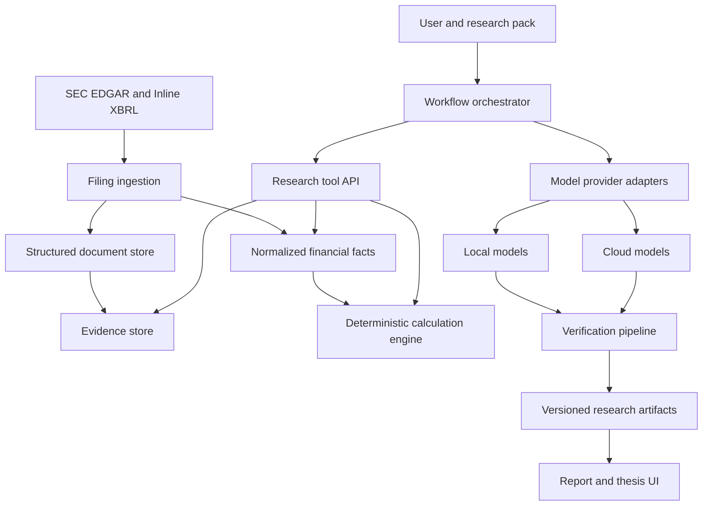
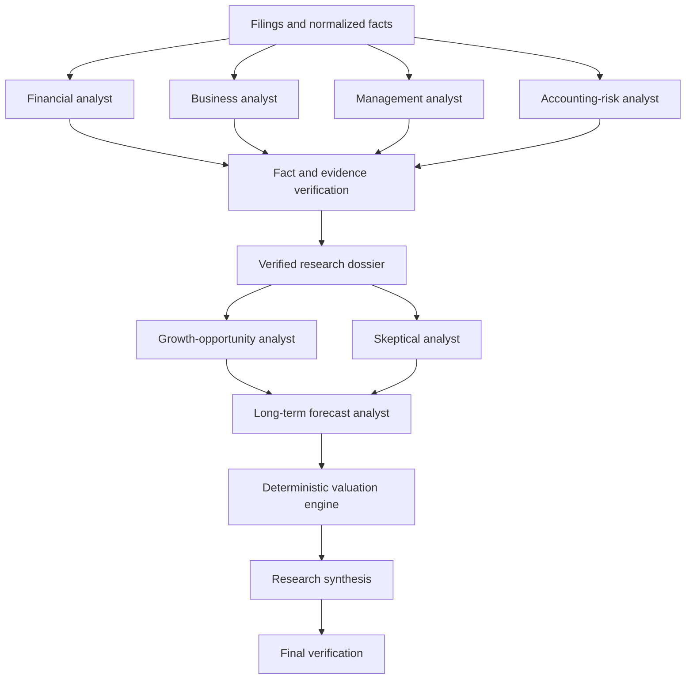

# OpenThesis Project Specification

Status: Draft v0.1  
Date: 2026-07-29  
Working title: OpenThesis

## 1. Purpose

OpenThesis is an open-source, AI-centered company research system for serious individual long-term investors.

The product does not attempt to predict short-term stock-price movements. It helps a user answer:

1. How does this company make money?
2. What does its financial history reveal about business quality?
3. Which company- or industry-level growth opportunities may matter over the next three to five years?
4. What assumptions are already implied by the current valuation?
5. Which facts support or contradict the investment thesis?
6. What future evidence would strengthen, weaken, or invalidate the thesis?

The user owns the model choice and investment decision. OpenThesis owns the research protocol, evidence handling, deterministic calculations, prompt packs, agent orchestration, verification, and reproducibility.

## 2. Confirmed product decisions

### 2.1 Target user

The first target user is a serious individual investor who understands basic financial concepts but does not have access to an institutional research terminal or analyst team.

The first version is not optimized for:

- complete beginners who want a single buy/sell answer;
- institutional teams requiring proprietary datasets and collaboration;
- traders focused on intraday or short-term price movements.

### 2.2 Initial market

The first supported market is US-listed equities.

The first document source is SEC EDGAR:

- 10-K filings;
- filing metadata and history;
- Inline XBRL and extracted company facts.

Useful official references:

- https://www.sec.gov/search-filings/edgar-application-programming-interfaces
- https://www.sec.gov/data-research/structured-data/inline-xbrl

A-share and Hong Kong support are later market adapters. They must not delay the first complete US-company research workflow.

### 2.3 No transaction functionality

OpenThesis will not:

- connect to brokerage accounts;
- hold brokerage credentials;
- submit, modify, or cancel orders;
- perform automatic trading;
- generate short-term trading signals;
- optimize engagement by encouraging trading frequency;
- claim guaranteed or model-proven returns.

Watchlists, hypothetical portfolios, research alerts, and investment-thesis monitoring are allowed because they support research rather than execution.

### 2.4 Model choice belongs to the user

The product must support both local and cloud models through a provider abstraction.

Initial provider scope:

- Ollama or an equivalent local provider;
- OpenAI-compatible HTTP APIs;
- at least one native cloud-provider adapter where the generic protocol is insufficient.

Every report records the provider, model identifier, model parameters, workflow version, research-pack version, and data snapshot.

## 3. Product principles

1. **Bring your own model.**
2. **Bring your own permitted data.**
3. **Every factual claim needs traceable evidence.**
4. **Financial math is deterministic code, not language-model arithmetic.**
5. **Facts, inferences, assumptions, and unknowns are separate data types.**
6. **Forecasts are scenarios, not precise prophecies.**
7. **Every report is reproducible.**
8. **The system must be able to say that evidence is insufficient.**
9. **AI supports decisions; the user makes them.**
10. **No research module may disable core safety and verification rules.**

## 4. Core user journey

### 4.1 Configure a model

The user selects a local, cloud, or custom model endpoint. The system tests:

- connectivity;
- structured-output support;
- tool-calling support;
- context capacity;
- optional vision support;
- expected report cost and latency.

API keys stay in local secret storage and must not be saved in reports, logs, exported research packs, or the main application database in plaintext.

### 4.2 Select a company

The user searches by company name, ticker, or CIK. The system shows:

- available filings;
- fiscal periods;
- filing and amendment dates;
- structured financial facts;
- any missing or conflicting data.

### 4.3 Select a research workflow

Initial workflow choices:

- quick company overview;
- complete long-term fundamental research;
- financial-statement quality review;
- compare two filing periods;
- management promise tracking;
- growth-opportunity research;
- long-term scenario forecast;
- reverse DCF;
- challenge an existing investment thesis.

The primary MVP path is complete long-term fundamental research.

### 4.4 Review the research plan

Before execution, the product shows:

- agents and steps that will run;
- selected models;
- tools each agent may use;
- estimated cost;
- maximum runtime;
- maximum calls;
- installed research pack and version.

The user can start, cancel, pause, or rerun an individual failed step.

### 4.5 Inspect results

The result is a structured report rather than a single block of generated prose. A user can click any factual claim to open its exact source.

### 4.6 Save a thesis

The user can accept, edit, reject, or mark conclusions as unresolved. Saved theses preserve their assumptions, evidence, counterevidence, risks, and invalidation conditions.

## 5. MVP scope

### 5.1 Required MVP capabilities

The first usable release must:

1. identify a US-listed company;
2. download and cache its latest five annual 10-K filings;
3. parse filing structure, text, tables, and available XBRL facts;
4. normalize core financial facts across periods;
5. support at least one local and one cloud-compatible model path;
6. run specialized financial, business, risk, growth, forecast, and verification steps;
7. produce a structured report with clickable evidence;
8. distinguish facts, inferences, assumptions, and unknowns;
9. calculate financial metrics and valuation outputs deterministically;
10. save a versioned investment thesis;
11. compare outputs from two selected models;
12. import an `.othesis` research module;
13. run locally through a documented, low-friction installation path.

### 5.2 Explicitly deferred

- real-time market data;
- automated periodic monitoring;
- 10-Q and earnings-call coverage beyond what is needed for the first workflow;
- A-share and Hong Kong filing adapters;
- brokerage integration;
- transaction execution;
- technical-analysis indicators;
- social stock recommendations;
- multi-user cloud collaboration;
- a public model leaderboard;
- arbitrary executable-code plugins;
- mobile applications.

## 6. High-level architecture



### 6.1 Version 0.1 implementation shape

- Interface: native Python/Tkinter Windows desktop application.
- Domain, ingestion, orchestration, and reporting: typed Python modules.
- Initial database: local SQLite with schema migration support.
- Document storage: the user's local OpenThesis data directory.
- Background tasks: in-process worker threads with persisted run status and artifacts.
- Deployment: PyInstaller onedir bundle distributed as a portable Windows ZIP.
- External runtime dependencies: none for the frozen application.

The domain and provider boundaries remain intentionally independent from Tkinter so a
web interface, service API, or alternative desktop shell can be added later without
rewriting the research engine.

## 7. Filing and evidence layer

### 7.1 Do not rely on flat chunk-only RAG

A filing must be represented structurally:

- filing metadata;
- document sections;
- paragraphs and text spans;
- tables and cells;
- XBRL facts and contexts;
- footnotes;
- source locations;
- amendments and restatements.

Flat chunking alone loses table relationships, accounting context, reporting period, unit, and source precision.

### 7.2 Canonical filing document

```json
{
  "document_id": "sec:CIK:accession",
  "company_id": "sec:CIK",
  "form_type": "10-K",
  "fiscal_period": "FY2025",
  "period_end": "2025-12-31",
  "filed_at": "2026-02-18T00:00:00Z",
  "amended_at": null,
  "sections": [],
  "tables": [],
  "facts": [],
  "content_hash": "sha256:..."
}
```

### 7.3 Canonical financial fact

```json
{
  "fact_id": "fact_123",
  "concept": "revenue",
  "reported_concept": "us-gaap:RevenueFromContractWithCustomerExcludingAssessedTax",
  "value": 12850000000,
  "unit": "USD",
  "period": "FY2025",
  "scope": "consolidated",
  "source_document_id": "sec:CIK:accession",
  "source_location": {
    "section": "financial-statements",
    "table": "consolidated-income-statement"
  }
}
```

### 7.4 Canonical evidence reference

```json
{
  "evidence_id": "ev_2819",
  "document_id": "sec:CIK:accession",
  "section_id": "management-discussion",
  "page_or_anchor": "item-7-liquidity",
  "text_span": "Operating cash flow decreased primarily because...",
  "published_at": "2026-02-18T00:00:00Z",
  "content_hash": "sha256:..."
}
```

### 7.5 Point-in-time requirements

The system distinguishes:

- fiscal-period end;
- original filing date;
- amendment date;
- data ingestion date;
- information availability date.

Historical replay must only expose information available at the selected point in time.

### 7.6 Data precedence

When sources disagree:

1. original company filing;
2. official structured data tied to the filing;
3. permitted trusted third-party data;
4. text extraction;
5. model inference.

Inferred data never silently replaces an official fact.

## 8. Research tool API

Models receive controlled tools rather than unrestricted database or filesystem access.

Initial tools:

```text
company.get_profile
filing.list
filing.get_sections
filing.get_section
filing.search
financials.get_statement
financials.get_fact
financials.compare
metrics.calculate
evidence.get
claim.verify
artifact.read
artifact.submit
```

Tool responses are typed, include provenance, and preserve period, scope, unit, and source.

The same tool layer may later be exposed through MCP, but the internal application contract must not depend on a single external agent protocol.

## 9. Model-provider abstraction

```ts
interface ModelProvider {
  id: string;
  listModels(): Promise<ModelInfo[]>;
  testConnection(): Promise<ConnectionResult>;
  generate(request: ResearchRequest): Promise<ResearchResponse>;
}
```

`ModelInfo` must describe capabilities rather than relying only on provider identity:

- structured output;
- tool calling;
- maximum context;
- vision;
- streaming;
- cost metadata when known.

A prompt compiler combines:

```text
core safety policy
    + research task
    + research-pack rules
    + model capability instructions
    + available evidence
    + output schema
```

The goal is not one universal prompt. It is one canonical task contract compiled for different model capabilities.

## 10. Multi-agent research workflow

The system uses a sequential main pipeline with parallel agents inside independent stages.



### 10.1 Agent responsibilities

**Financial analyst**

- historical statements;
- profitability and cash conversion;
- ROIC and free cash flow;
- balance-sheet strength;
- working-capital changes;
- dilution and capital expenditure.

**Business analyst**

- revenue mechanism;
- product, customer, and geographic mix;
- competitive advantages;
- pricing power;
- cyclicality and industry position.

**Management analyst**

- past commitments and outcomes;
- capital allocation;
- acquisitions, repurchases, dividends, and dilution;
- incentives;
- changes in management narrative.

**Accounting-risk analyst**

- profit versus cash flow;
- revenue recognition;
- capitalization;
- one-off items;
- related-party transactions;
- goodwill and impairment;
- accounting-policy and auditor changes.

**Growth-opportunity analyst**

- existing growth engines;
- developing commercial opportunities;
- industry-level growth drivers;
- business-driver formulas;
- evidence, counterevidence, leading indicators, capital requirements, and invalidation conditions.

**Skeptical analyst**

- attacks assumptions;
- finds conflicting evidence;
- identifies omitted costs and competition;
- tests whether growth is already priced in.

**Forecast analyst**

- produces operating scenarios;
- uses verified artifacts rather than raw unsupported prose;
- provides ranges, probabilities, dependencies, and failure conditions.

**Verifier**

- checks citations, numbers, periods, units, and claim support;
- is implemented primarily through deterministic rules with limited model assistance.

### 10.2 Agent communication

Agents exchange typed artifacts, not unbounded conversation history.

Downstream agents may:

- accept an artifact;
- reject it with explicit validation errors;
- request missing evidence;
- preserve unresolved disagreements.

No agent may silently rewrite another agent's conclusion.

### 10.3 Execution modes

- **Quick:** one selected model performs multiple roles with isolated contexts.
- **Standard:** separate role executions and verification.
- **Committee:** different user-selected models perform different roles and compare disagreements.

Multi-agent output is never resolved by simple majority vote.

## 11. Research artifact and claim model

Every material conclusion is stored as a claim:

```json
{
  "claim_id": "claim_123",
  "text": "Cash conversion has weakened over the last two fiscal years.",
  "kind": "inference",
  "status": "verified",
  "confidence": 0.78,
  "supporting_evidence": ["ev_102", "ev_184"],
  "contradicting_evidence": ["ev_207"],
  "assumptions": [],
  "unresolved_questions": [],
  "created_by": {
    "agent": "financial-analyst",
    "model": "provider:model",
    "workflow_step": "financial-review"
  }
}
```

Allowed claim kinds:

- `fact`;
- `calculation`;
- `inference`;
- `assumption`;
- `forecast`;
- `risk`;
- `unknown`.

## 12. Investment thesis graph

The thesis is a versioned graph, not only a Markdown report.

Node types:

- claim;
- evidence;
- metric;
- assumption;
- growth opportunity;
- risk;
- forecast;
- unresolved question.

Edge types:

- supports;
- contradicts;
- depends on;
- invalidates;
- derived from;
- needs verification.

New filings update affected nodes while preserving historical versions.

## 13. Standard report contract

The official report contains:

1. company and business model;
2. historical financial performance;
3. earnings quality;
4. balance-sheet strength;
5. competitive advantages;
6. management and capital allocation;
7. existing growth engines;
8. potential company growth opportunities;
9. industry changes and value allocation;
10. growth-opportunity counterarguments;
11. bear, base, and bull operating scenarios;
12. current-price implied expectations;
13. valuation and sensitivity;
14. investment thesis;
15. thesis invalidation conditions;
16. leading indicators to monitor;
17. unresolved questions;
18. evidence and methodology.

A section may be incomplete. The application must show missing evidence rather than generate filler.

The report must not show definitive labels such as “strong buy,” “sell now,” or a claimed model win rate.

## 14. Growth-to-Forecast Protocol

### 14.1 Evidence grades

| Grade | Meaning | Scenario eligibility |
|---|---|---|
| A | Repeated realized commercial evidence | Bear, base, and bull as appropriate |
| B | Initial customers, orders, or revenue | Limited base; full bull |
| C | Investment and trials, little commercialization | Bull only |
| D | Management plan only | Track as optionality |
| E | Narrative or unsupported market story | Excluded |

### 14.2 Maturity stages

```text
Narrative
→ Evidence
→ Commercial
→ Repeatable
→ Scaled
→ Mature
```

### 14.3 Required opportunity fields

Each opportunity includes:

- title and category;
- economic mechanism;
- evidence and counterevidence;
- maturity stage and evidence grade;
- business-driver formula;
- time horizon;
- probability range;
- capital requirements;
- possible cannibalization;
- leading indicators;
- invalidation conditions;
- scenario eligibility;
- whether it appears already reflected in valuation.

### 14.4 Quantification

The model proposes business assumptions. Deterministic code calculates results.

Generic formulas:

```text
Revenue opportunity
= addressable units × attainable share × revenue per unit

Incremental free cash flow
= incremental revenue × incremental margin
 - incremental capital expenditure
 - incremental working capital

Probability-weighted value
= discounted future free cash flow × realization probability
```

### 14.5 User approval

An opportunity cannot silently enter a base-case forecast. The interface shows the assumptions, evidence, probability, and value impact. The user may:

- accept;
- edit;
- move it to a different scenario;
- retain it only as optionality;
- exclude it.

Excluded opportunities remain visible with their exclusion reason.

## 15. Long-term forecasting and valuation

### 15.1 Forecast target

The system forecasts business variables, not short-term stock direction:

- revenue and business-driver growth;
- operating margin;
- free cash flow;
- ROIC;
- capital expenditure;
- dilution;
- selected company-specific KPIs;
- defined risk-event probabilities.

### 15.2 Forecast output

```yaml
scenario: base
horizon_years: 5
probability: 0.50
revenue_cagr:
  point: 0.11
  range: [0.08, 0.14]
terminal_operating_margin:
  point: 0.21
  range: [0.18, 0.23]
assumptions: []
invalidation_conditions: []
```

Bear, base, and bull probabilities must be explicit and normalized.

### 15.3 Valuation

Initial valuation tools:

- reverse DCF;
- forward DCF;
- sensitivity analysis;
- historical valuation context.

The calculation engine performs all valuation math. Agents explain and challenge inputs.

The preferred first question is:

> What operating assumptions must be true for the current market price to be justified?

## 16. Modular research packs

### 16.1 Package format

A research module is distributed as one `.othesis` file. It is a ZIP-compatible declarative package.

Example:

```text
community.saas-growth.othesis
├── manifest.yaml
├── workflow.yaml
├── prompts/
├── schemas/
├── rules/
├── rubrics/
├── examples/
├── tests/
└── README.md
```

The project ships an official built-in pack:

```text
official.long-term-fundamentals
```

### 16.2 Package responsibilities

A pack may define:

- research questions;
- agent prompts;
- workflow steps;
- evidence levels;
- growth-opportunity categories;
- industry-specific metrics;
- scenario-admission rules;
- output schemas;
- report sections;
- benchmark rubrics.

A pack declares required model capabilities and allowed research tools. It does not require a particular model vendor.

### 16.3 Package layering

```text
non-overridable core safety policy
    → official base research pack
    → optional sector pack
    → user override layer
```

### 16.4 Security restrictions

The first package version allows:

- YAML;
- Markdown;
- JSON Schema;
- restricted formula expressions.

It does not allow:

- Python, JavaScript, shell, or arbitrary executable code;
- unrestricted network requests;
- filesystem access;
- secret access;
- transaction capabilities;
- modification of raw source documents or official facts.

Restricted formulas are parsed by a safe expression engine. They are never passed to `eval`.

### 16.5 Installation

Before installation the application:

1. validates the archive and manifest;
2. checks compatibility;
3. displays requested tools and permissions;
4. scans for prohibited files and constructs;
5. runs included validation tests;
6. records package id, version, source, and content hash.

Built-in, signed-community, local-user, and untrusted packages are visibly distinguished.

## 17. Reproducibility

Every report records:

```yaml
generated_at: 2026-07-29T12:30:00Z
data_as_of: 2026-07-29T00:00:00Z
source_snapshot_hash: sha256:...
provider: user-selected
model: provider-model-id
model_parameters:
  temperature: 0.2
research_pack:
  id: official.long-term-fundamentals
  version: 0.1.0
  hash: sha256:...
workflow:
  id: complete-fundamental-research
  version: 0.1.0
application_version: 0.2.0
```

User edits are stored as new versions and attributed to the user rather than being presented as model output.

## 18. Benchmark design

The benchmark measures financial research ability separately from future investment performance.

### 18.1 Filing research track

Initial scoring:

| Dimension | Weight |
|---|---:|
| Financial fact accuracy | 20% |
| Calculation accuracy | 15% |
| Citation correctness and completeness | 20% |
| Earnings-quality and risk discovery | 15% |
| Fact/inference/unknown separation | 10% |
| Counterargument quality | 10% |
| Consistency and reproducibility | 5% |
| Cost and latency | 5% |

Negative metrics are reported separately:

- unsupported claim rate;
- citation error rate;
- numeric hallucination rate;
- overconfidence rate.

### 18.2 Anti-contamination strategy

- frequently refreshed post-cutoff filings;
- hidden private evaluation sets;
- anonymized companies;
- internally consistent transformed financial statements;
- controlled tools with network access disabled;
- evidence-required scoring;
- public development cases separated from leaderboard cases.

### 18.3 Live prospective track

The model submits frozen, timestamped probability distributions for future business variables and risk events. Outcomes are scored later using:

- interval coverage;
- forecast error;
- Brier score or another proper scoring rule;
- probability calibration;
- risk-event precision and recall;
- thesis-break detection delay.

Stock return may be shown as secondary context, not used as the primary measure of filing-research quality.

### 18.4 Evaluation governance

Open-ended cases use expert-authored atomic rubrics. Another language model must not be the sole judge.

## 19. Failure behavior

The application must fail visibly and safely.

A workflow step may return:

```yaml
status: insufficient_evidence
reason:
  - segment data unavailable
  - two official facts could not be reconciled
recommended_action:
  - inspect filing section manually
  - provide an additional source
```

The application blocks final publication when:

- critical numerical validation fails;
- a citation does not exist;
- reporting periods or scopes are mixed;
- required forecast inputs are missing;
- source versions conflict;
- structured model output remains invalid after bounded retries.

## 20. Security and privacy

### 20.1 Untrusted inputs

Filings, webpages, user documents, prompts, and research packs are untrusted input.

The system must defend against:

- prompt injection in documents;
- malicious PDFs or archives;
- path traversal in `.othesis` packages;
- secret extraction;
- unauthorized network access;
- server-side request forgery through custom endpoints;
- unsafe formula evaluation;
- logs containing credentials or private research.

### 20.2 Model data disclosure

Before a cloud-model call, the user can see which documents or excerpts will leave the local system.

Provider-specific data-retention behavior should be documented where known. Local-only mode must not silently call cloud services.

### 20.3 Tool permissions

Every agent and research pack receives an explicit tool allowlist. Tool calls, arguments, outputs, and validation results are recorded in the research run.

## 21. Cost and performance controls

The system supports:

- run-level cost limits;
- call-count limits;
- maximum runtime;
- bounded retries;
- cancellation;
- step-level rerun;
- parsed-document caching;
- financial-fact caching;
- prompt and response caching where safe;
- incremental analysis of new filings;
- smaller-model routing for extraction tasks;
- stronger-model routing for synthesis and challenge tasks.

A new filing should update affected thesis nodes rather than force a complete reanalysis of all history.

## 22. Open-source extension layout

Proposed repository organization:

```text
apps/
  web/
services/
  api/
packages/
  domain/
  provider-sdk/
  research-pack-sdk/
  tool-protocol/
  schemas/
providers/
markets/
  us-sec/
research-packs/
  official.long-term-fundamentals/
workflows/
benchmarks/
docs/
```

Contribution units should remain small:

- provider adapters;
- market adapters;
- prompts;
- research packs;
- financial metrics;
- benchmark cases;
- translations.

## 23. Licensing and business model

License is not yet decided.

Candidate approaches:

- Apache-2.0 for broad adoption and ecosystem growth;
- AGPL for stronger protection against unshared hosted forks;
- dual licensing for an open community edition and commercial use.

The open-source version should remain genuinely usable:

- local execution;
- user-selected models;
- SEC filing ingestion;
- full core research workflow;
- thesis management;
- basic model comparison;
- research-pack import.

Potential future hosted services may charge for:

- managed infrastructure;
- automatic filing updates;
- multi-device synchronization;
- team collaboration;
- permitted commercial data;
- large-scale screening;
- notification delivery.

## 24. Success criteria

MVP success is not measured by investment returns.

Initial product metrics:

- time from ticker entry to a cited research report;
- factual and citation accuracy;
- unsupported-claim rate;
- percentage of claims inspectable from source;
- successful local installation rate;
- successful completion rate across supported models;
- cost and latency per workflow;
- number and quality of external research-pack/provider contributions;
- whether users return to update an existing thesis rather than only generate one-off reports.

## 25. Implementation milestones

### Milestone 0: contracts and fixtures

- finalize project name or preserve working title;
- choose license;
- define domain schemas;
- create a small frozen SEC filing fixture;
- define evidence and claim contracts;
- define provider and tool interfaces;
- define `.othesis` v1 manifest and validation rules.

Exit criterion: contracts can represent one company's filing, claims, evidence, workflow, and research pack without running a model.

### Milestone 1: deterministic filing foundation

- SEC company lookup and filing download;
- HTML and Inline XBRL parsing;
- canonical facts and source anchors;
- core financial calculations;
- local persistence;
- point-in-time metadata.

Exit criterion: the application produces an accurate, cited deterministic financial summary without AI.

### Milestone 2: single-model research

- provider abstraction;
- local and cloud-compatible adapters;
- prompt compiler;
- controlled research tools;
- structured financial and business research;
- citation and numerical verification.

Exit criterion: one selected model produces a report whose factual claims can be inspected and verified.

### Milestone 3: multi-agent pipeline

- parallel research roles;
- verified research dossier;
- growth and skeptical agents;
- long-term scenario agent;
- deterministic valuation;
- synthesis with unresolved disagreements.

Exit criterion: a complete end-to-end report can be rerun from recorded inputs.

### Milestone 4: thesis and module ecosystem

- thesis graph and history;
- `.othesis` import, permissions, validation, and tests;
- official built-in research pack;
- model comparison;
- exportable report.

Exit criterion: a user can install a safe declarative module and use it in a reproducible research run.

### Milestone 5: benchmark

- public development set;
- hidden evaluation runner;
- objective filing metrics;
- benchmark report format;
- foundation for future live prospective submissions.

## 26. Version 0.1 decisions

The first release fixes the following choices:

1. project and package name: OpenThesis;
2. license: Apache-2.0;
3. interface: native Tkinter desktop shell;
4. packaging: portable Windows x64 application;
5. provider paths: Ollama and OpenAI-compatible chat-completions APIs;
6. normalized facts: revenue, operating income, net income, operating cash flow,
   capital expenditure, assets, liabilities, equity, cash, receivables, inventory,
   and shares outstanding;
7. source scope: SEC 10-K filing HTML and Company Facts XBRL;
8. modules: declarative, permission-limited `.othesis` packages;
9. secrets: session-only and never stored by OpenThesis.

Still open for later architecture decisions:

- additional industry data sources;
- 10-Q and earnings-call ingestion;
- persistent task cancellation and retry;
- default model cost budgets and routing;
- signed community distribution for `.othesis` packages;
- a web or cross-platform interface.

## 27. Version 0.1 implementation status

The first usable vertical slice is implemented:

```text
Ticker or company name
→ SEC filing and XBRL ingestion
→ structured text, table, and normalized fact evidence
→ deterministic metrics
→ optional reverse DCF implied expectations
→ configurable multi-agent research
→ evidence verification and optional model comparison
→ report and append-only investment thesis
→ portable Windows application
```

Release acceptance is exercised by the automated unit suite, an offline deterministic
workflow smoke test, and a mapped-window GUI smoke test against the frozen executable.
The benchmark milestone remains intentionally deferred: investment-return backtests are
not treated as a valid shortcut for measuring evidence quality or research discipline.
